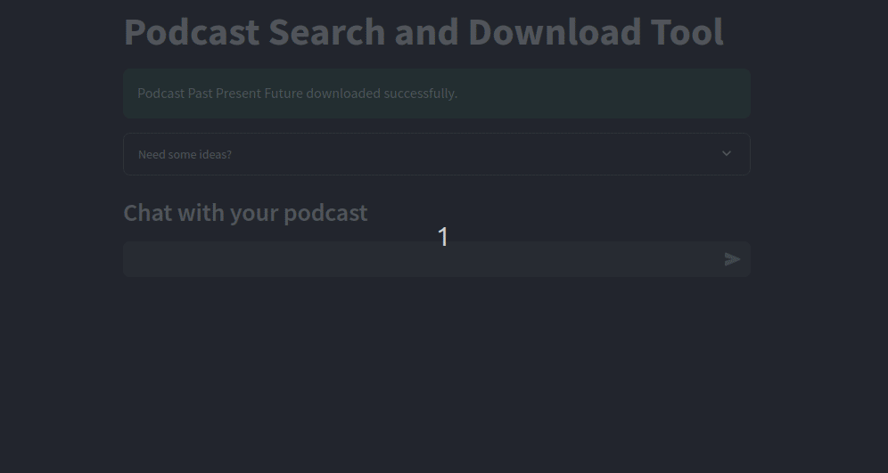
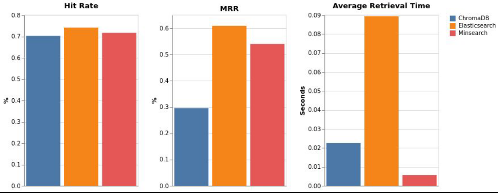

# DEEP-POD



## Problem description

This is deep-pod 🎙️, a streamlit app that allows you to interact with your podcast through:

1. Chat 💬
2. Summary 📝
3. Topic detection 🔍

Check out the [DEEP-POD infographic](DEEP-POD-Infographic.pdf) for a discussion on the general architecture and design of the tool and how each component was evaluated.

**You can try the app [here](https://simple-deep-pod.streamlit.app/) 🚀**

**Chat 💬**

For this functionality, I built a RAG pipeline using the podcast's transcript. 

*Data Ingestions and Transcription*

Podcast episodes are downloaded in one of two ways:

1. By providing a URL for the desired episode
2. By providing a keyword

After the mp3 file is downloaded, I proceed to the transcription and indexing processes.

I'm using [Replicate's](https://replicate.com/vaibhavs10/incredibly-fast-whisper) 'incredibly fast whisper' to transcribe the mp3 files 🎵. Replicate provides access to LLMs (and GPUs) using APIs. The incredibly fast whisper costs approximately $0.0079 per run. (in 4 days it cost me $2.14). Note: Even with Replicate's GPU backed models, transcription can be slow especially for long format podcasts. One trick is to shrink the audio file size by decreasing the file's bit rate and using a mono stream. For a 25 min podcast it can take between 30-45 seconds to transcribe the episode. 

The returned object contains the transcript as a string and as a list of sentences, thus I no longer need to chunk the text (at least for now; I'm considering trying thematic or sentiment chunking to weed out ads).

For more details, check out the RAG flow section below.

**Summary 📝**

Good old web scrapping 🕸️

**Topic detection 🔍**

I'm using [GLiNER](https://huggingface.co/urchade/gliner_base) for named entity recognition 🧠. GLiNER is a very strong technique that can detect any kind of topic using bidirectional encoders to process the contexts and to facilitate parallel entity extraction. 

However, I noticed that its NER detection can be impacted if it's given a large text, on the other hand, it is slow and extra granular when given smaller chunks. This part is still a work in progress. 🚧

To use the app, you may need:

- OpenAI API key 🔑
- Replicate API key 🔑
- Elasticsearch API key 🔑
- Elasticsearch Cloud ID ☁️

## RAG flow


*Search*

For indexing the text, I'm using an Elasticsearch cloud index ☁️ (I'm taking advantage of the 14 day trial period, it costs $95 per month, will look for alternatives) (https://lnkd.in/eVqkyg9s) 

When a user provides a query in the chat bar, the query is encoded and a semantic search is conducted against the index to retrieve the top 5 documents (chunked by sentence).

*Prompt*

A prompt that includes the search query and the top 5 documents is constructed.

*Respond*

And for text generation, I'm using GPT 4o 🤖 (Less than $1 over the past 4 days) (https://lnkd.in/e9fiapjS). The prompt is passed to the completion API and the contents are retrieved and presented to the user.

Check the RAG code [here](rag.py)

## Retrieval evaluation

I compared the retrieval performance of the 3 indexes on their Hit-Rate, MRR, and average retrieval time:



| Search Engine | Hit Rate | MRR    | Average Retrieval Time |
|---------------|----------|--------|------------------------|
| Minsearch     | 71.69%   | 54.00% | 0.0057 seconds         |
| Elasticsearch | 74.15%   | 60.90% | 0.0893 seconds         |
| ChromDB       | 70.80%   | 29.65% | 0.0200 seconds         |

The Hit-Rate (aka Recall) is calculated as follows:

$$\text{Hit-Rate} = \frac{\text{Number of Hits}}{\text{Total Number of Requests}}$$

MRR (Mean Reciprocal Rank) on the other hand is calculated as follows:

$$\text{MRR} = \frac{1}{|Q|} \sum_{i=1}^{|Q|} \frac{1}{\text{rank}_i}$$

Where:
- $|Q|$ is the total number of queries
- $\text{rank}_i$ is the rank of the first relevant document for the $i$-th query
- If no relevant document is retrieved for a query, the reciprocal rank is 0 for that query

The reciprocal rank for a single query is calculated as:

$$\text{reciprocal rank} = \frac{1}{\text{rank of first relevant document}}$$


## RAG evaluation

The RAG pipeline wass evaluated using an LLM-as-a-judge. A sample of 200 questions is passed to each LLM and the evaluator determines whether the answer is: relevant, partly relevant, or not relevant.

Here are the results:

| Model  | Relevant | Partly Relevant | Not Relevant |
|--------|----------|-----------------|--------------|
| GPT-4o | 54.5%    | 36.0%           | 9.5%         |
| FLAN-5 | 0.00%    | 61.0%           | 39%          |


## Interface

A streamlit interface is built on top of the app. Through the interface, users can download the podcast to interact with it through chat, summary, or topic modelling. 

Check the interface code [here](interface.py)

## Ingestion pipeline 

Data ingestion is handled with a python script. The script does two things:

1. Uses the iTunes API to search and download for the requested episode
2. Creates an Elasticsearch index with the encoded text

Check the ingestion code [here](ingest.py)

## Monitoring

⚠️ In progress (...)

## Containerization 

⚠️ In progress (...)

## Reproducibility 

To reproduce the work from the GitHub repository "deep-pod":

**Setup**
- Clone the repo: `git clone https://github.com/el-grudge/deep-pod.git`
- Install required packages: `pip install -r requirements.txt`
- Download language model with `python -m spacy download en_core_web_sm`

**Access Data**
- Episodes can be downloaded by providing a URL or podcast name.

**APIs**

You will need access to the following APIs:

1. **OpenAI API Key**:
   - Sign up or log in to [OpenAI](https://beta.openai.com/signup/).
   - Navigate to [API Keys](https://platform.openai.com/account/api-keys) to create and manage your API key.

2. **Replicate API Key**:
   - Create an account on [Replicate](https://replicate.com/).
   - Find your API key in the [account settings](https://replicate.com/account).

3. **Elasticsearch API Key**:
   - Use [Elasticsearch Service](https://www.elastic.co/cloud/elasticsearch-service) and generate API keys via Kibana’s [API key management](https://www.elastic.co/guide/en/elasticsearch/reference/current/security-api-create-api-key.html).

4. **Elasticsearch Cloud ID**:
   - The Cloud ID is available in the [Elasticsearch Cloud console](https://www.elastic.co/guide/en/cloud/current/ec-cloud-id.html) after deploying your instance.

**Run the App**

Run the app using `streamlit run interface.py`

## Best practices

⚠️ In progress (...)

## Bonus points (not covered in the course)

The streamlit app was deployed on the streamlit community cloud, where it can be accessed [here](https://deep-pod.streamlit.app/). 

Also, Elasticsearch cloud was used as the vector store. Alternatively, Elasticsearch can be run locally using the following command:

```bash
docker network create elastic

docker run -it \
    --rm \
    --name elasticsearch \
    -p 9200:9200 \
    -p 9300:9300 \
    -e "discovery.type=single-node" \
    -e "xpack.security.enabled=false" \
    -e "ES_JAVA_OPTS=-Xms2g -Xmx2g" \
    --memory=4g \
    docker.elastic.co/elasticsearch/elasticsearch:8.15.0
```

Make sure to change the code that defines the Elasticsearch client to point to  [localhost:9200](localhost:9200)